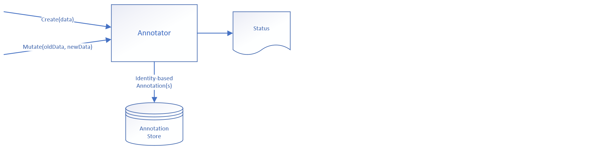
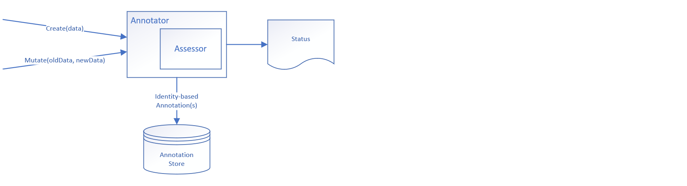
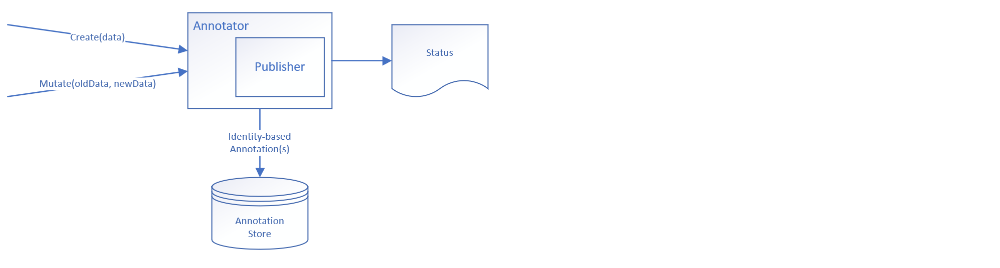
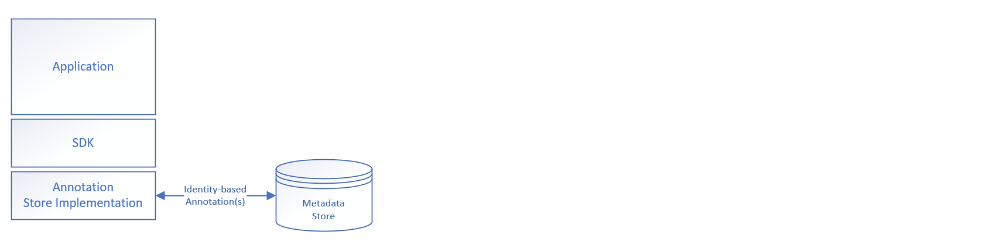
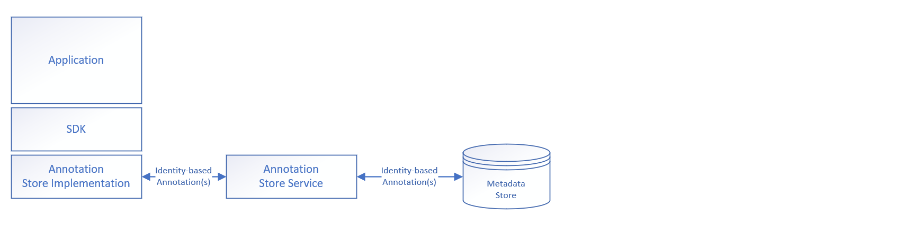
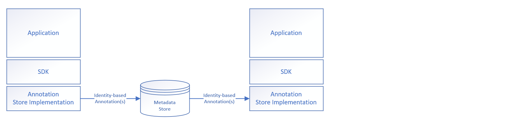

# Annotators

Annotators evaluate data to create annotations.   


## Table of Contents

- [Important Concepts](#important-concepts)

  - [Annotators](#annotators)
    - [PKI Annotators](#pki-annotators)
      - [PKI Signer Implementation](#pki-signer-implementation)
      - [TPM Signer Implementation](#tpm-signer-implementation)
    - [Assess Annotators](#assess-annotators)
      - [PKI Assessor Implementation](#pki-assessor-implementation)
    - [Publish Annotators](#publish-annotators)
      - [Example Publisher Implementation](#example-publisher-implementation)
      - [IPFS Publisher Implementation](#ipfs-publisher-implementation)
      - [Tangle Publisher Implementation](#tangle-publisher-implementation)
    - [Provenance](#provenance)
    - [Filters](#filters)
  - [Annotations](#annotations)
  - [Annotation Store](#annotation-store)
    - [Possible Future Implementations](#possible-future-implementations)

- [Annotator Project Substructure](#annotator-project-substructure)

  

## Important Concepts

### Annotators

The SDK defines an [annotator abstraction](contract.go).

Annotators evaluate and potentially act upon data.

Annotators can:

- Evaluate data to create annotations;
- Retrieve and assess existing annotations to create assessments (which themselves can be annotations);
- Retrieve and publish existing annotations (the result of which may become annotations).

The SDK provides example implementations for each of these types of annotators.

#### PKI Annotators

The SDK implements a [public key infrastructure (PKI) annotator](pki/annotator.go).  

This annotator leverages a [signer abstraction](pki/signer/contract.go) to sign and capture signature annotations for the provided data's identity and content.  It also creates annotations for the public key and other metadata required to subsequently validate the signatures.

Two separate signer implementations -- PKI and TPM -- are provided.

##### PKI Signer Implementation

This [signer](pki/signer/signpkcs1v15/pki.go) implements a software-based cryptography solution using version 1.5 of RSA's Public Key Cryptography Standards (PKCS).  

During instantiation, the signer is provided corresponding x.509-encoded private and public keys used to sign and verify the data.  

##### TPM Signer Implementation

This [signer](pki/signer/signtpmv2/tpm.go) implements a hardware-based Trusted Platform Module (TPM) cryptography solution.

The signer assumes a key has been provisioned on the TPM and accepts a handle to a TPM object.  The [unit tests](pki/signer/signtpmv2/tpm_test.go) and [multistage example code](/cmd/examples/multistage/main.go) both create an ephemeral key pair -- review either for an example implementation.  

Ideally, a key pair would be created and stored on the TPM device to be used across multiple executions of the application(s) that leverage this signer.

#### Assess Annotators



The SDK implements an [assess annotator](assess/annotator.go).

This annotator leverages an [assessor abstraction](assess/assessor/contract.go) to assess the annotations associated with the provided data's identity.  It also creates annotations that document the resulting assessment.

A single assessor implementation for PKI validation is provided.

##### PKI Assessor Implementation

This [assessor](assess/assessor/pki/assessor.go) implements software-based signature validation using version 1.5 of RSA's Public Key Cryptography Standards (PKCS).  

This assessor uses the annotations created by the [PKI Signer](#pki-signer-implementation) and [TPM Signer](#tpm-signer-implementation) implementations to validate the annotated signatures.  This is recursive; all relevant annotations for a given identity and its previous identities are assessed.

This assessor also creates annotations that document which signatures (by unique identity) were evaluated and whether or not they could be validated.

#### Publish Annotators



The SDK implements a [publisher annotator](publish/annotator.go). 

This annotator leverages a [publisher abstraction](publish/publisher/contract.go) to publish annotations for the provided data.  It also creates annotations corresponding to the publication result.

Three separate publisher implementations are provided -- example, IPFS, and Tangle.

##### Example Publisher Implementation

This [publisher](publish/publisher/example/publisher.go) illustrates how annotations can be marshalled to JSON and the result accessed for printing; see the the [example code](/README.md#example-code) for sample usage.  This publisher does not create any new annotations.

##### IPFS Publisher Implementation

This [publisher](publish/publisher/ipfs/publisher.go) publishes annotations to an [InterPlanetary File System](https://ipfs.io/) (IPFS) instance.  This is recursive; all annotations for a given identity and its previous identities are included.

This publisher also creates annotations that document the result of the publication attempt.  If successful, the annotation includes the corresponding IPFS content identifier.  If unsuccessful, the annotation documents the attempt and captures information associated with the failure.

Instructions on configuring a local IPFS instance are detailed in the [IPFS documentation](publish/publisher/ipfs/README.md).

##### Tangle Publisher Implementation

This [publisher](publish/publisher/iota/publisher.go) publishes annotations to an [IOTA Tangle](https://www.iota.org/research/meet-the-tangle) instance.

This publisher also creates annotations that document the result of the publication attempt. If successful, the annotation includes the corresponding IOTA Tangle content identifiers. If unsuccessful, the annotation documents the attempt and captures information associated with the failure.

Instructions on configuring a local IOTA Tangle instance are detailed in the [IOTA Tangle SDK documentation](publish/publisher/iota/README.md). 

#### Provenance

The SDK defines a [provenance abstraction](provenance/contract.go). 

This abstraction is used by all of the annotators included in the SDK as a way to pass application-level annotations to an annotator during instantiation.  These application-level annotations can be anything -- some examples include a node name (as illustrated in the [example code](/README.md#example-code)), information that identifies the specific application (and its version number) that created the data, or environmental context.

The SDK annotators include the provenance annotations in a separate "provenance" object in the annotation's "metadata" property.  See the output from the [example code](/README.md#example-code) for an example. 

The provenance abstraction is not part of the annotator contract and is not required to be implemented by third-party-created annotators.  

#### Filters

The SDK defines a [filter abstraction](/filter/contract.go).

This abstraction is used by the [assess annotator](#assess-annotators) and [publish annotator](#publish-annotators) included in the SDK to filter the annotations acted upon by these annotators.  A [passthrough filter](filter/passthrough/filter.go) implementation that does not filter annotations is provided. 

The filter abstraction is not part of the annotator contract and is not required to be implemented by third-party-created annotators.  


### Annotations

The SDK defines an [annotation abstraction](../annotation/contract.go).

An annotation contains metadata derived from and related to specific data.  The SDK implements a common annotation envelope that includes a unique identifier, current and previous identities (and corresponding type), a created datetime stamp, and a general metadata object (and corresponding type).  

There are many different annotations standards (for example, W3C PROV or W3C Open Annotations); the SDK currently has its own non-standard implementation.  However, the future vision is to provide generic support for multiple annotation standards.  

Annotations are created by annotators and persisted in an annotation store.


### Annotation Store

The SDK defines an [annotation store abstraction](../annotation/store/contract.go) and includes an [in-process, in-memory implementation](../annotation/store/memory/store.go) to facilitate the example code.

An annotation store persists annotations for retrieval by identity.  It understands the common annotation envelope and for a given identity will return annotations linked by its previous identity property.  This is recursive; all annotations for a given identity and its previous identities are returned.

#### Possible Future Implementations

The annotation store can be implemented as a library that uses a common MySQL, Mongo, or some other persistence implementation's instance to store and query annotations:

Alternately, it can be implemented as a separate micro service that provides centralized storage:



Or it can be implemented as stream-based storage where an application utilizing the SDK to create annotations streams those annotations to a centralized (possibly cloud-based) location against which a separate application could execute queries to assess and/or publish those annotations:




## Annotator Project Substructure

```
README.md                                This file
README.assets/                           Images and assets included in README.md

contract.go                              Annotator abstraction

assess/                                  Assessor annotator
    assessor/
        contract.go                      Assessor abstraction
        pki/                             Public key infrastructure (PKI) assessor
            factory/
                contract.go              PKI Factory abstraction
                fail/                    PKI Factory fail stub for testing
                verifier/                PKI verifier factory
            metadata/                    PKI assessment definitions
            verifier/                    PKI-related verifiers
                contract.go              PKI verifier abstraction
                verifypkcs1v15/          PKCS1v15 verifier implementation
                verifytpmv2/             TPMv2 verifier implementation
    metadata/                            Common assessor-annotator annotation definitions
    stub/                                Assessor stub for testing
    annotator.go                         Assessor annotator implementation

filter/                                  Annotation filter implementation
    contract.go                          Annotation filter abstraction
    matching/                            Annotation filter implementation
    passthrough/                         Annotation filter passthrough implementation

pki/                                     Public key infrastrcuture (PKI) Annotator
    metadata/                            PKI-specific annotation definitions
    signer/
        contract.go                      Signer abstraction
        fail/                            Signer fail stub for testing
        reducer/                         Reducer annotation to implementation
        signpkcs1v15/                    PKCS1v15 signer implementation
            hash/                        PKCS1v15 signer annotation to/from implementation
            metadata/                    PCKS1v15 signer-specific annotation definitions
        signtpmv2/                       TPMv2 signer implementation
            factory/                     TPMv2 OpenTPM variations (Linux, Windows)
            metadata/                    TPMv2 signer-specific annotation definitions
            provisioner/                 TPMv2 certificate provisioner
    annotator.go                         PKI annotator implementation
    
provenance/                              Annotator's provenance abstraction

publish/                                 Publisher annotator
    metadata/                            Publisher-specific annotation definitions
    publisher/
        contract.go                      Publisher abstraction
        example/                         Example publisher (used for testing)
        iota/                            IOTA Tangle Publisher
            README.md                    IOTA Tangle Publisher Set Up Documentation
            metadata/                    IOTA Tangle publisher-specific annotation definitions
            sdk/                         IOTA Tangle SDK facade implementation
                contract.go              IOTA Tangle SDK contract
                iota/                    IOTA Tangle SDK facade
                stub/                    IOTA Tangle SDK stub for testing
        ipfs/                            IPFS Publisher
            README.md                    IPFS Publisher Set Up Documentation
            metadata/                    IPFS publisher-specific annotation definitions
            sdk/                         IPFS SDK facade implementation
                contract.go              IPFS SDK contract
                ipfs/                    IPFS SDK facade
                stub/                    IPFS SDK stub for testing
    stub/                                Publish stub for testing
    annotator.go                         Publisher annotator implementation

stub/                                    Annotator stub for testing
```

